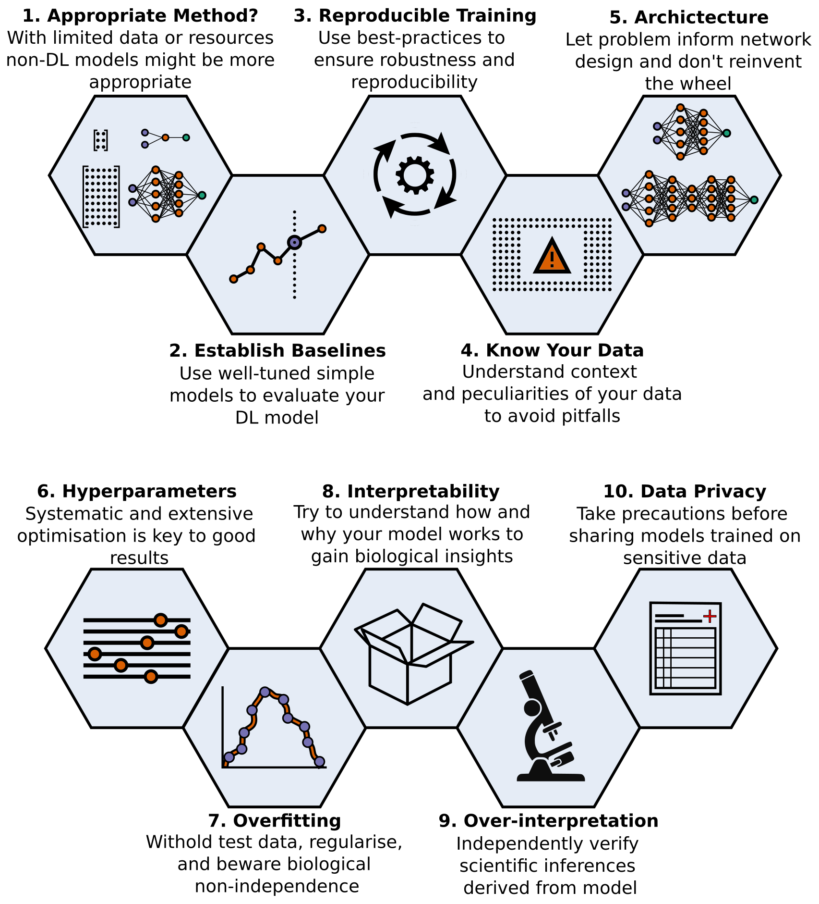

## Introduction {#intro}

Machine learning is a modern approach to problem-solving and task automation. In particular, machine learning is concerned with the development and applications of algorithms that learn how to recognize patterns in data and utilize these for predictive modeling, as opposed to having domain experts developing rules for prediction tasks manually.
Artificial neural networks are a particular class of machine learning algorithms and models that evolved into what we now describe as "deep learning" -- that is, neural networks with many layers (and algorithms that make them perform well).
These neural networks comprise artificial neurons arranged into layers and are modeled after the human brain, even though the building blocks and learning algorithms may differ [@doi:10.1038/s41583-020-0277-3].
Each layer receives input from previous layers (the first of which represents the input data) and then transmits a weighted version of its input to the subsequent layer. 
Thus, the process of "training" a neural network is the tuning of the layers' weights to minimize a 
cost or loss function that serves as a differentiable surrogate of the prediction error.
Deep learning utilizes artificial neural networks with many layers (hence the term "deep"). Given the computational advances made in the last decade, it can now be applied to massive data sets and in innumerable contexts.
In many circumstances, deep learning can learn more complex relationships and make more accurate predictions than other methods.
Therefore, deep learning has become its own subfield of machine learning. In the context of biological research, it has been increasingly used to derive novel insights from high-dimensional biological data [@doi:10.1098/rsif.2017.0387].
For example, deep learning has been used to predict protein-drug binding kinetics [@doi:10.1038/s41467-017-02388-1], to identify the lab-of-origin of synthetic DNA [@doi:10.1038/s41467-018-05378-z], and to uncover the facial phenotypes of genetic disorders [@doi:10.1038/s41591-018-0279-0].

General resources communicating best practices to the scientific community broadly and 
the biological community specifically are scarce, and any resources that do exist are prone 
to reaching obsolescence rapidly due to deep learning's active and specialized nature.
In addition, the lack of established standards or concise recommendations for the application of deep learning to 
biological questions further limits newcomers from using state-of-the-art deep learning in their research.  

To make deep learning more accessible to biological researchers, we solicited input from a community of researchers with varied biological and deep learning interests.
These individuals collaboratively contributed to this manuscript's writing using the GitHub version control platform [@url:https://github.com/Benjamin-Lee/deep-rules] and the Manubot manuscript generation toolset [@doi:10.1371/journal.pcbi.1007128].
The goal was to articulate a practical, accessible, and concise set of guidelines and suggestions for biologically oriented researchers to follow when using deep learning (Figure @fig:overview-fig).

{#fig:overview-fig}

In the course of our discussions, several themes became clear: the importance of understanding and applying machine learning fundamentals [@doi:10.1186/s13040-017-0155-3] as a baseline for utilizing deep learning, the necessity for extensive model comparisons with careful evaluation, and the need for critical thought in interpreting results generated by deep learning, among others.
The major similarities between deep learning and traditional computational methods also became apparent.
Although deep learning is a distinct subfield of machine learning, it is still a subfield.
It is subject to the many limitations inherent to machine learning, and many best practices for machine learning also apply to deep learning.
In addition, as with all computational methods, deep learning should be applied in a systematic manner that is reproducible and rigorously tested.
Ultimately, the tips we collate range from high-level guidance to best practices for implementation. It is our hope that they will provide actionable, deep learning-specific instruction for both new and experienced deep learning practitioners.
By making deep learning more accessible for use in biological research, we aim to improve the overall usage and reporting quality of deep learning in the literature and enable increasing numbers of researchers to effectively and accurately utilize these state-of-the-art techniques.
